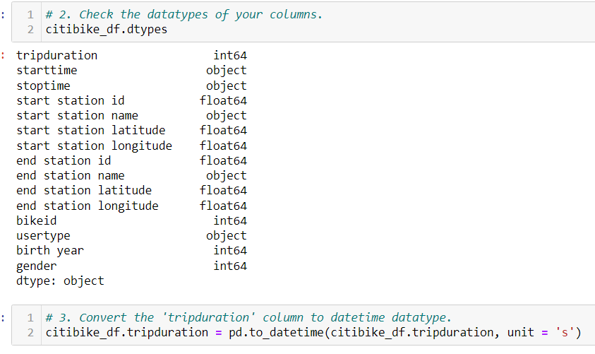
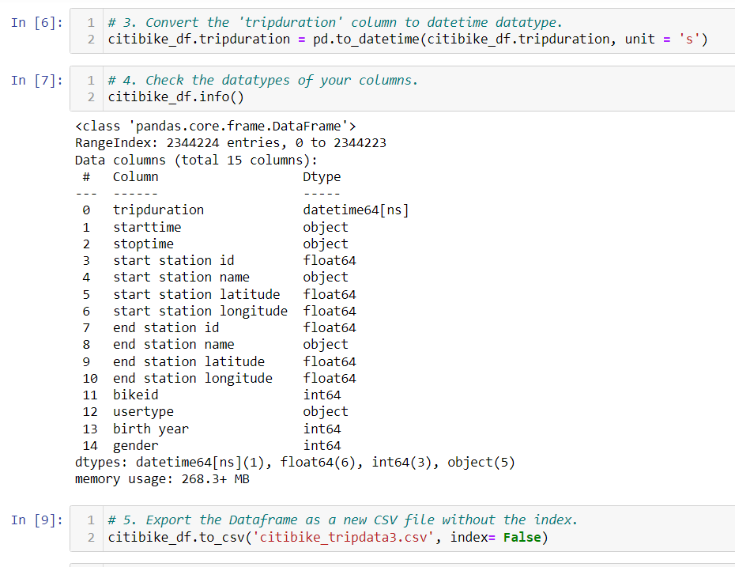

## NYC Citibike

Bikesharing with Tableau

# Purpose

Our clients wanted to to create a buisness proposal to start a bikesharing program like NYC Citibike in Des Moines. August 2019 Ciitbike data was analyzed in order to determine if this would be a good investment for Des Moines. In this challenge, we:
    1. Imported data into Tableau.
    2. Created and customized worksheets, dashboards and stories in Tableau.
    3. Used Tableau dashboards to display data in a professional way.
    4. Portrayed data accurately into a story format that is easy to present using Tableau stories.

# Link to Tableau Story:
[Tableau Story](https://public.tableau.com/views/CitiBikeChallenge_16782371195000/FinalPresentation?:language=en-US&:display_count=n&:origin=viz_share_link)

# Deliverable 1: Cleaning the Data

Using the csv file NYC Citibike data, we changed the trip duration to a datetime field and added a new column using Jupyter Notebook.

# Results of the NYC Citibike Analysis

# 1. Start and End Locations
[Starting and Ending Locations](https://public.tableau.com/views/CitiBikeChallenge_16782371195000/FinalPresentation?:language=en-US&:display_count=n&:origin=viz_share_link)
The top starting locations and the top ending locations are similar across the board. Most active starting locations are also most active ending locations.

# 1. Bike Checkout Times 
[Checkout Times for Users](https://public.tableau.com/shared/CSB4PKSPG?:display_count=n&:origin=viz_share_link)
The majority of Citibikes usage were 30 minutes or less per user.

# 2. Bike Checkout Times by Gender
[Checkout Times by Gender](https://public.tableau.com/shared/NGH3XXTBD?:display_count=n&:origin=viz_share_link)
It was found that males use the citibikes more than others.

# 3. Trips (Weekday per Hour)
[Bike Usage by Day and Time](https://public.tableau.com/shared/8TD4Y9P84?:display_count=n&:origin=viz_share_link)
7AM-9AM are peak riding hours during the weekday in the morning and 5PM-7PM in the evening. 8AM-8PM are peak riding hours on the weekends.

# 4. Trips by Gender (Weekday per Hour)
[Bike Usage by Day, Time and Gender](https://public.tableau.com/shared/SCYTR8XYG?:display_count=n&:origin=viz_share_link)
Males use the bikes much more than others during the peak hours of the weekday. 

# 5. Trips by Gender and User Type (Weekday per Hour)
[Customer and Subscriber Breakdown by Gender](https://public.tableau.com/shared/YD4G5JWTX?:display_count=n&:origin=viz_share_link)
It was found that male subscribers utilize the bikes more than females and unknowns.

# 6. Bike Utilization vs. Bike Repairs
[Bike Repairs vs. Bike Utilization](https://public.tableau.com/shared/7QCHQ7DJ8?:display_count=n&:origin=viz_share_link)
It can be assumed that the bikes with higher utilization need the most repairs more often than those who are not utilized as much.

# Summary

It is clear that a bike-share company like NYC's Citi Bike could be successful in a city that is highly active and also has a high population of individuals. Additionally, it seems as though males are heavily utilizing the bike, so this could be something to look into. A further analysis could be done to figure out why, and then apply that same thing to Des Moines, or not. Nonetheless, Des Moines would be a great location for such a program. 

# Additional Analysis

1. Number of Rides per Hour with Bike ID
[Number of Rides per Hour with Bike ID](https://public.tableau.com/views/CitiBikeChallenge_16782371195000/NumberofRidesperHourwithBikeID?:language=en-US&:display_count=n&:origin=viz_share_link)
For the Bike Utilization vs Bike Repairs, we said that it may be more beneficial to use a differernt visualization to find this coordination. This could be done by figuring out the number of rides per hour. Non-peak hours are 1AM-5AM; along with the number of ride with bike ID. The line shows that there are high use on 1/3 of the bikes. It can be concluded that bike repairs for 1/3 of citibikes should be done during between the time periods of 1AM-5AM.

2. User Type Starting Location
[User Type Starting Location](https://public.tableau.com/views/CitiBikeChallenge_16782371195000/UserTypeStartingLocation?:language=en-US&:display_count=n&:origin=viz_share_link)
Subscribers are more likely to start a trip farther than the center of NYC than others.

